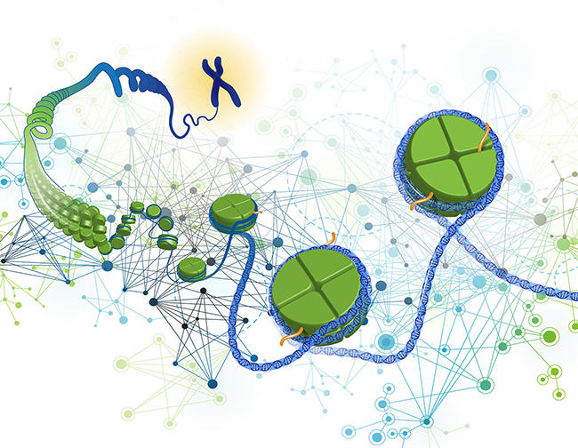

```{r, include=FALSE}
knitr::opts_chunk$set(
  results='asis', 
  echo = FALSE
)

library(glue)
library(tidyverse)

# Set this to true to have links turned into footnotes at the end of the document
PDF_EXPORT <- FALSE

# Holds all the links that were inserted for placement at the end
links <- c()

source('parsing_functions.R')

# Load csv with position info
position_data <- read_csv('positions.csv')

# Apply bold formatting ONLY to "Singh SK" in Publications and Presentations
position_data <- position_data %>%
  mutate(title = ifelse(section %in% c("articles", "presentations"),  # Apply to both sections
                        paste0("<span class='presentation-title'>", 
                               str_replace(title, "Singh SK", "<b>Singh SK</b>"), 
                               "</span>"),
                        title))
```


```{r}
# When in export mode the little dots are unaligned, so fix that. 
if(PDF_EXPORT){
  cat("
  <style>
  :root{
    --decorator-outer-offset-left: -6.5px;
  }
  </style>")
}
```

Aside
================================================================================

{width=100%}


```{r}
# When in export mode the little dots are unaligned, so fix that. 
if(PDF_EXPORT){
  cat("View this CV online with links at _sksingh.me/cv_")
} else {
  cat("[<i class='fas fa-download'></i> Download a PDF of this CV](https://github.com/sansin5982/CV_Sandeep/blob/main/Sandeep_Singh_CV.pdf)")
}
```

Contact {#contact}
--------------------------------------------------------------------------------
- <i class="fa fa-envelope"></i> ssing023@fiu.edu
- <i class="fa fa-envelope"></i> sansin5982@gmail.com
- <i class="fa fa-twitter"></i> s_singh5982
- <i class="fa fa-github"></i> [github.com/Sandeep](https://github.com/sansin5982)
- <i class="fa fa-linkedin"></i> [LinkedIn.com/Sandeep](https://www.linkedin.com/in/sandeep-kumar-singh-phd-50200919/)
- <i class="fa fa-phone"></i> +91 7007629474


Language Skills {#skills}
--------------------------------------------------------------------------------

```{r}
skills <- tribble(
  ~skill,               ~level,
  "R",                  4.5,
  "RMarkdown",          4.5,
  "R Shiny",            4.0,
  "Python",             4.5,
  "UNIX",               4,
  "Git",                4,
  "Plotly DASH",        3.5,
  "AWK",                 3.5
)

build_skill_bars(skills)
```

Disclaimer {#disclaimer}
--------------------------------------------------------------------------------

Main
================================================================================

Sandeep Kumar Singh, PhD {#title}
--------------------------------------------------------------------------------

```{r}
intro_text <- "I investigate genetic variants driving complex diseases, with a focus on psychiatric genomics, cancer genetics, and immune disorders. Using GWAS, statistical genetics, and bioinformatics, I explore gene-environment interactions and key modifiers like age, sex, and ancestry. By integrating machine learning and functional annotation, I translate genomic insights into precision medicine." 

cat(sanitize_links(intro_text))
```

Research and Teaching Experience {data-icon=laptop}
--------------------------------------------------------------------------------

```{r}
print_section(position_data, 'positions')
```

Education {data-icon=graduation-cap data-concise=true}
--------------------------------------------------------------------------------

::: aside
**Genomic Data Analysis** GWAS, RNA-Seq, ChIP-seq

**Tools and Software** PLINK, RICOPILI, LDSC, GCTA, ASSET, LDAK, MiXer, MAGMA, FUMA,  bcftools, samtools, bedtools, GATK, VEP, ANNOVAR, IGV, Enrichr, Github, etc.

**Bioinformatics/Biostatistics** Hypothesis Testing,  Correlation, Linear and Logistic Regression, Survival Analysis, Cluster Analysis, Multivariate Analysis, Linear Mixed Models, Exploratory Data Analysis, Machine Learning, Deep Learning, GenAI (Basics), Epidemiology  
:::


```{r}
print_section(position_data, 'education')
```

Publications {data-icon=book}
--------------------------------------------------------------------------------

```{r}
print_section(position_data, "articles")
```

Grants and Awards {data-icon=scroll}
--------------------------------------------------------------------------------

::: aside
I am passionate about education and believe that no topic is too complex when taught with empathy and innovative approaches. An effective teacher adapts to diverse learning styles, making even the most challenging concepts accessible and engaging. 
:::

```{r}
print_section(position_data, 'grants_awards')
```

Selected Presentations {data-icon=comments}
--------------------------------------------------------------------------------
::: aside
**Github Notes/projects**

[Genomics](https://sansin5982.github.io/Genomics/)

[GWAS protocol](https://github.com/sansin5982/Genome-wide-Association-Study-protocol/blob/main/GWAS-protocol.md)

[Statistics](https://sansin5982.github.io/Statistics-with-R/)

[Mendelian Randomization](https://sansin5982.github.io/Mendelian-Randomization/chapters/Mendelian-Randomization)

[T1D-MS project](https://github.com/sansin5982/T1D-and-MS-markers-subset-of-HLA-region-association/blob/master/T1D_MS.md)
:::

```{r}
print_section(position_data, 'presentations')
```

Selected Data Science Writing {data-icon=chart-line}
--------------------------------------------------------------------------------

```{r}
print_section(position_data, 'data_science_writings')
```


```{r}
if(PDF_EXPORT){
  cat("
  
Links {data-icon=link}
--------------------------------------------------------------------------------

<br>


")
  
  walk2(links, 1:length(links), function(link, index){
    print(glue('{index}. {link}'))
  })
}
```

```{r, include=FALSE}
#Creating PDF file
# setwd("G:/SANDEEP/WORK/JOBS/Cover Letter/cv-master/cv-master")
# pagedown::chrome_print(
#   input = "index.html",
#   output = "Sandeep_Singh_CV.pdf",
#   timeout = 120 # Increase timeout to 120 seconds
# )
```

